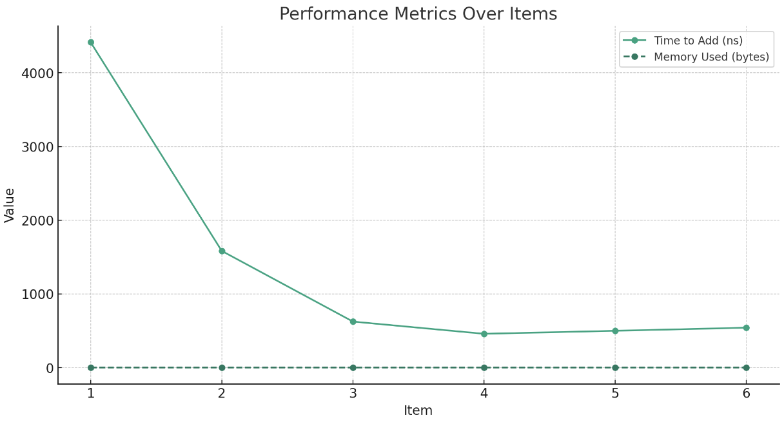
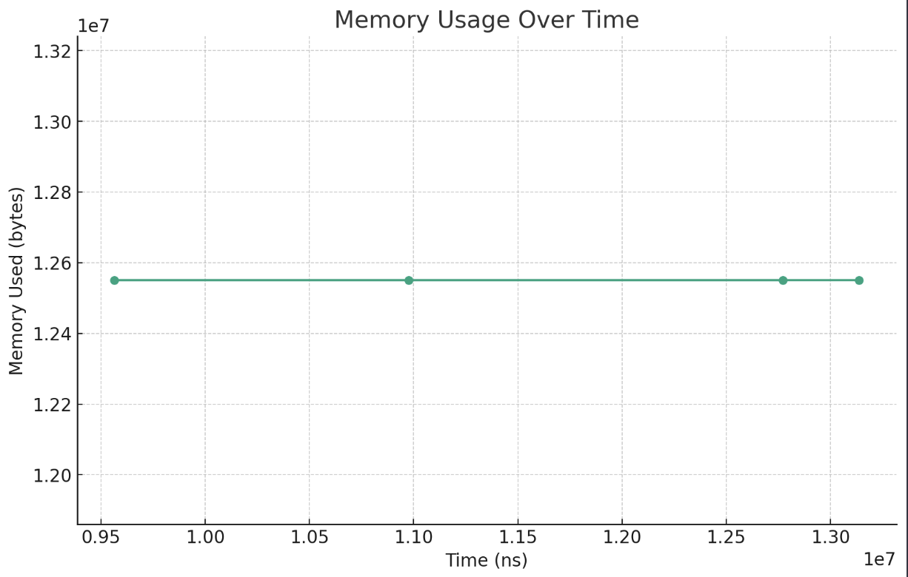
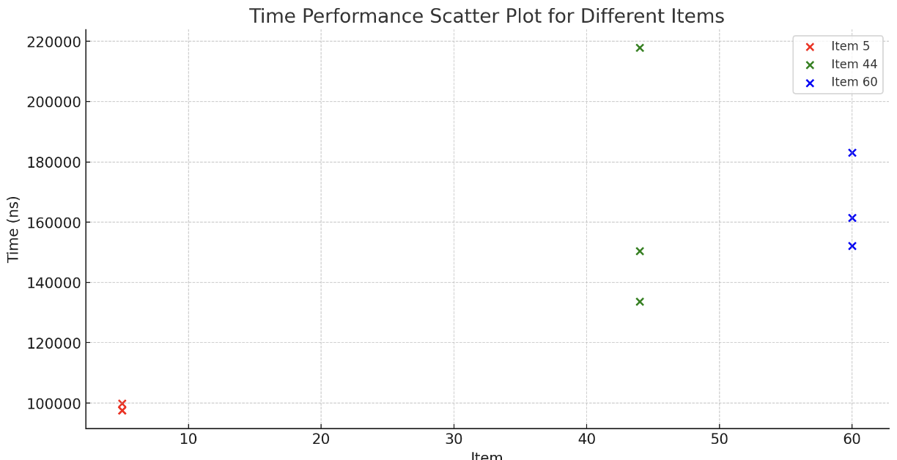

# Time/Space Complexity Analysis

Projects to Cover

A) Doraemon's Magic Pocket

B) Project 1: Popular Songs of 2023 By release year (only cover reading from CSV file and storying to array
 
C) a recursion and memoization in Baskin Robbins 31 game

# Time Complexity
A) Time Complexity is O(n) because worst case scenario if new array created and copied elements to new (longer) array.

Otherwise , adding to array is O(1). Removing from array is O(n) because it must traverse array to remove the item and then shifting or unshifting elements so elements are saved linearly in memory

B) Time complexity is O(n) since n represents the number of lines the while loop traverses when reading CSV file.

C) Time complexity is O(n). The memoization version saves executed function call's answer to a hash-map. Time complexity of hash map is O(1) but we will have n number of times we will have to look at the hash-map.
If there was no memoization, the time complexity would be O(2^n). Since we are recursively calling a function, N becomes exponential as two functions calls are created each time a function is called. Without memorization, we end up calculating repeated functions which is less efficient.

# Space Complexity
A) Space complexity is O(n) since an  ArrayList can hold n amount of items. Only 1 ArrayList was used to hold memory

B) Space complexity is O(n). Even though we are using two arrays to hold year and yearCount, we drop constants so O(2n) turns to O(n).

C) Space complexity is O(n) since we are using a hash-map to store n number of key-pair values and number of calls in stack would turn 2n to n. The n input dictates how deep the call stack we go and how large the hash-map becomes.
The original implementation without memoization is also O(n). The call stack depth will depend on n input.

# Experimental Validation
Originally, I planned to use the profiler to get tracking data for CPU and memory allocation, but there were issues with my MacBook pro.
I then resorted to using `.nanoTime()` to capture time stats and `memoryMXBean.getHeapMemoryUsage().getUsed()` to capture memory stats.

A) Doraemon's Magic Pocket

The second half of the graph, shows that adding an item to an ArrayList was equal to O(1). Meaning O(1) is constant time. Unfortunately, there were issues capturing memory so I was not able to assess if space complexity was correct. 

B) Project 1: Popular Songs of 2023 By release year (only cover reading from CSV file and storying to array

For the Project 1, I was able to capture the memory used when reading and storing entries into an array. The issue was I could not manipulate the csv file without breaking the program so I could not show the amount of data impacting time and space complexities.

C) Recursion and memoization in Baskin Robbins 31 game

The graph clearly shows a time complexity of O(n) as you can see the line increases linearly. 
I also ran into issues with capturing memory use so I was only able to evaluate time complexity. 